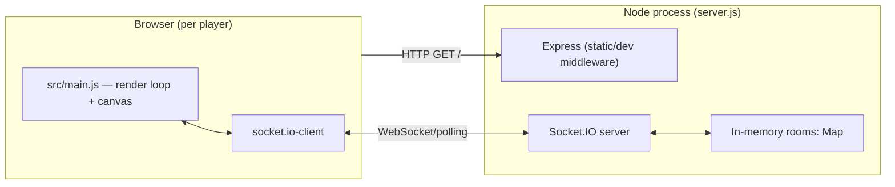
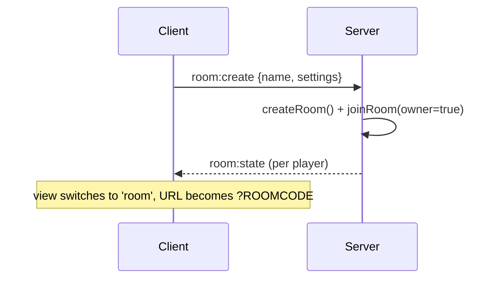
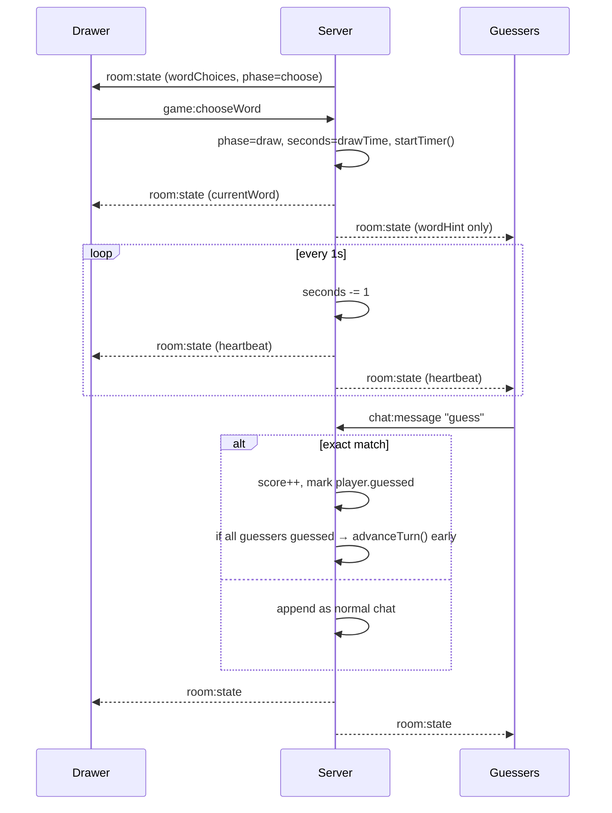
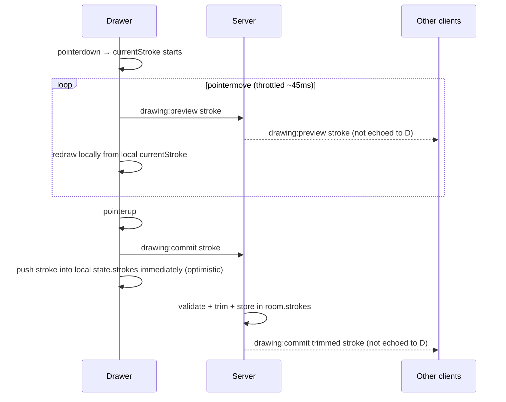
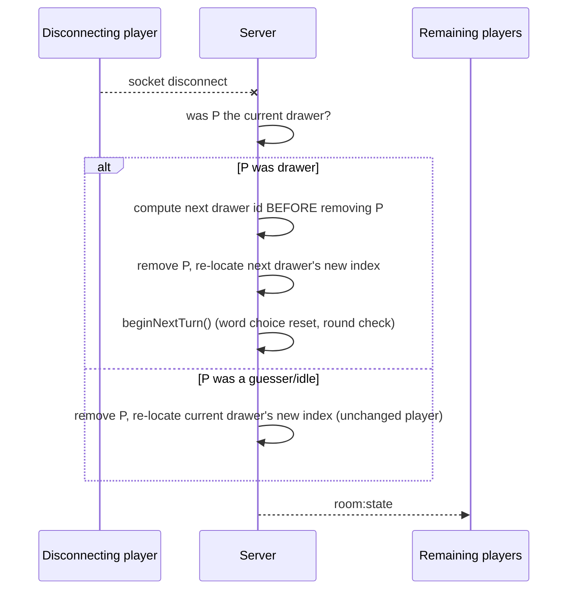

# Skribble Clone — Architecture & Socket Reference

This document explains how the running system fits together: process layout, the
Socket.IO event protocol, the client rendering model, and the bugs found and fixed
in this pass (with root cause and fix). For original design intent, see `reasoning.md`.

## 1. Process layout

There is exactly one server process and one authoritative `rooms` Map (`server.js:31`).
Every browser tab is one Socket.IO connection; a socket only ever belongs to zero or
one room, tracked via `socket.data.roomCode` (`server.js:187`) and Socket.IO's own
room membership (`socket.join(room.code)`).

The server is authoritative for all game state (drawer, timer, word, scores). Clients
never decide who draws next or whether a guess is correct — they only send intent
events and render whatever state the server broadcasts back.

## 2. Socket event catalog

### Client → Server

| Event | Payload | Server behavior |
|---|---|---|
| `room:create` | `{ name, settings }` | Creates a `Room`, joins the socket as owner (`server.js:49`) |
| `room:join` | `{ code, name }` | Validates room exists / has space, joins as non-owner (`server.js:54`) |
| `room:updateSettings` | `settings` | Owner-only; merges + re-validates settings (`server.js:67`) |
| `game:chooseWord` | `word` (string) | Only accepted from the current drawer during `phase==='choose'` (`server.js:74`) |
| `chat:message` | `text` (string) | Guess/chat during `phase==='draw'`; exact match scores points (`server.js:89`) |
| `drawing:preview` | `{ tool, color, size, points }` | Live in-progress stroke, drawer-only, re-broadcast to others (`server.js:109`) |
| `drawing:commit` | same shape as preview | Finalized stroke; stored in `room.strokes` (`server.js:115`) |
| `drawing:undo` | — | Pops the last stroke (`server.js:122`) |
| `drawing:clear` | — | Clears `room.strokes` (`server.js:129`) |
| `disconnect` | (built-in) | Removes the player, transfers ownership/turn if needed (`server.js:136`) |

### Server → Client

| Event | Payload | Purpose |
|---|---|---|
| `room:state` | Full sanitized room snapshot (see below) | Sent to **every player in the room individually** any time anything changes: join/leave, settings change, word chosen, chat, undo/clear, and once per second while the draw timer runs |
| `room:error` | string message | Room not found / room full |
| `drawing:preview` | stroke | Forwarded to everyone **except** the sender |
| `drawing:commit` | stroke | Forwarded to everyone **except** the sender (client commits its own stroke locally — see §5) |

`room:state` is **personalized per player** (`clientState()`, `server.js:226`): only the
current drawer receives `currentWord` and `wordChoices`; everyone else gets a
partially-blanked `wordHint` instead. This is why `emitRoomState()` loops over
`room.players` and calls `io.to(player.id)` once per player rather than a single
`io.to(room.code)` broadcast — Socket.IO auto-joins every socket to a room named
after its own `socket.id`, so `io.to(playerId)` reaches exactly that one client.

## 3. Key sequence flows

### Join / create room

### Turn loop

### Drawing sync

### Disconnect mid-turn

## 4. Client rendering model

`src/main.js` is a single-file, dependency-free "immediate mode" UI: `render()`
rebuilds `#app.innerHTML` from the current `state` object and re-binds listeners.
This is simple but has one important nuance that matters for correctness, described
in §5: **not every state update goes through a full `render()`**. Once the room shell
exists, subsequent `room:state` updates go through `patchRoom()`, which updates only
the specific DOM nodes that changed (timer, round, word chip, players list, chat log,
drawer banner, tool/swatch disabled state, word-chooser visibility) and redraws the
canvas — without touching the chat `<input>` or recreating the `<canvas>` element.

## 5. Bugs found and fixed in this pass

### 5.1 Turn skipped/misassigned when the drawer disconnects mid-turn (`server.js`)

**Root cause:** the old `disconnect` handler clamped `room.drawerIndex` into the
freshly-filtered `players` array (`Math.min(oldIndex, newLength - 1)`), then — because
the departing player *was* the drawer — called the normal `advanceTurn()`, which
unconditionally adds another `+1`. Removing an element shifts every later player down
by one index, so the clamp step had *already* landed on the correct next drawer; the
extra `+1` from `advanceTurn()` then skipped over them.

Reproduced with 5 players `A,B,C,D,E` (array order = turn order): with `C` drawing and
disconnecting, the old code handed the turn to `E`, skipping `D` entirely. Verified
this is fixed: the new code computes the next drawer's *id* before mutating the array
(from the pre-removal array + length, so it's independent of the removal), re-locates
that id's new index after filtering, and reuses the same phase-transition logic
(`beginNextTurn()`) that normal timer-driven turns use — without a second `+1`.
Confirmed via an automated 5-tab test: `D` (not `E`) becomes the next drawer.

### 5.2 Chat input loses focus and typed text every second while a guess is drawn (`src/main.js`)

**Root cause:** the draw-phase timer ticks every second on the server and each tick
calls `emitRoomState()`, i.e. every player receives a `room:state` event once a
second. The old client handled *every* `room:state` with a full `render()`, which
replaces `#app.innerHTML` — destroying and recreating the `<input id="chat-input">`
element. Any guess a player was mid-typing, and keyboard focus itself, was silently
wiped once a second.

**Fix:** `room:state` now triggers a full `render()` only the first time a player
enters the room (`enteringRoom` check); every subsequent update goes through
`patchRoom()`, which never touches the chat form's DOM nodes. Verified: filled the
chat input, waited over 3 timer ticks, and the typed text and focus were both intact.

### 5.3 Canvas/pointer-drawing disruption + stroke flash on the same root cause (`src/main.js`)

The same full-`innerHTML` replacement recreated the `<canvas>` element (and thus lost
the drawing context/pointer handlers momentarily) on every timer tick, and separately
force-nulled `state.previewStroke` on every `room:state`, causing the currently
in-progress line to blink out once a second while drawing. Fixed by the same
`patchRoom()` change, plus only clearing the local preview when the client isn't
actively mid-stroke (`previewStroke: isDrawing ? state.previewStroke : null`).

### 5.4 Committed stroke flashes away before reappearing (`server.js` + `src/main.js`)

**Root cause:** `drawing:commit` was broadcast with `io.to(room.code)`, which
includes the sender. The client relied entirely on that echo to push the stroke into
`state.strokes`, and blanked the local preview immediately on `pointerup` — so on any
non-trivial latency, the just-drawn line disappeared and only reappeared once the
round trip came back.

**Fix:** server now uses `socket.to(room.code)` (excludes the sender, matching how
`drawing:preview` already worked); the client commits the stroke into its own
`state.strokes` immediately on `pointerup` instead of waiting for the server echo.

### 5.5 No recovery from a transient disconnect (`src/main.js`)

Socket.IO auto-reconnects after a network blip, but a reconnect gets a **new**
`socket.id`, and the server already treated the *old* socket's `disconnect` as a
permanent room departure (removed from `room.players`, ownership/turn transferred,
etc). The old client had no way back into the room after a reconnect — it just sat on
a stale `view: 'room'` with no player entry server-side. Fixed by re-emitting
`room:join` with the previously-known room code and name on `connect`, if the client
was already in a room.

### 5.6 Biased word shuffling (`server.js`)

`sampleWords()` used `array.sort(() => Math.random() - 0.5)`, a well-known
non-uniform "shuffle" (comparator-based sorts don't guarantee each permutation is
equally likely). Replaced with a proper Fisher–Yates shuffle.

### 5.7 Missing "everyone guessed" early turn advance (`server.js`)

Not a regression, but a real gap versus expected skribbl-style behavior: previously
a round only ended when the timer hit zero, even after every guesser had already
scored. Added: when every non-drawer player has `guessed === true`, the turn advances
immediately instead of waiting out the clock.

## 6. Known limitations (not fixed — larger scope)

- **No reconnection grace period / session tokens.** §5.5's fix re-joins as a *new*
  player (score reset) rather than restoring the same player's seat. A real fix needs
  a persistent player token issued at join time and a short grace window before the
  server treats a drop as a real departure.
- **Room state is in-process memory only** (`const rooms = new Map()`), so it does
  not survive a server restart and cannot be horizontally scaled without moving state
  to something shared (e.g. Redis) — already called out as a production follow-up in
  `reasoning.md`.
- **No auth/rate limiting** on chat or room creation.
