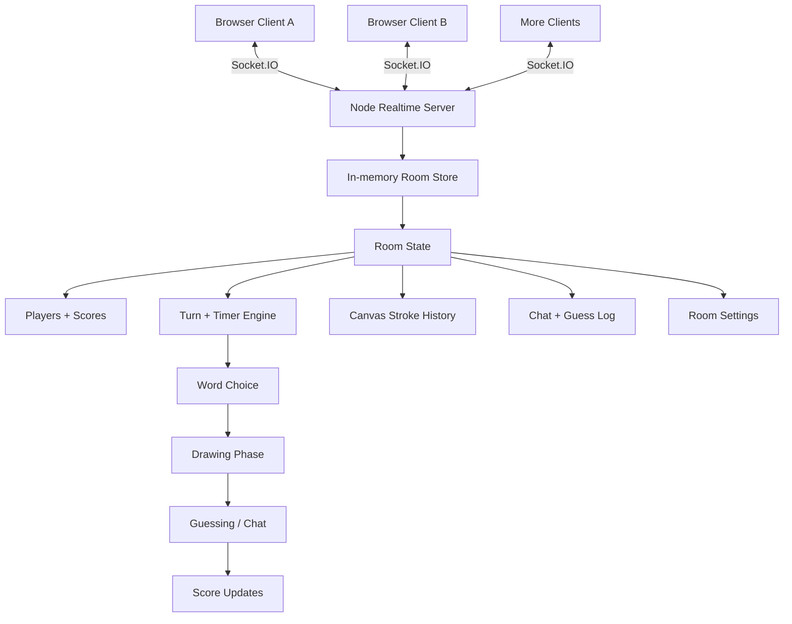
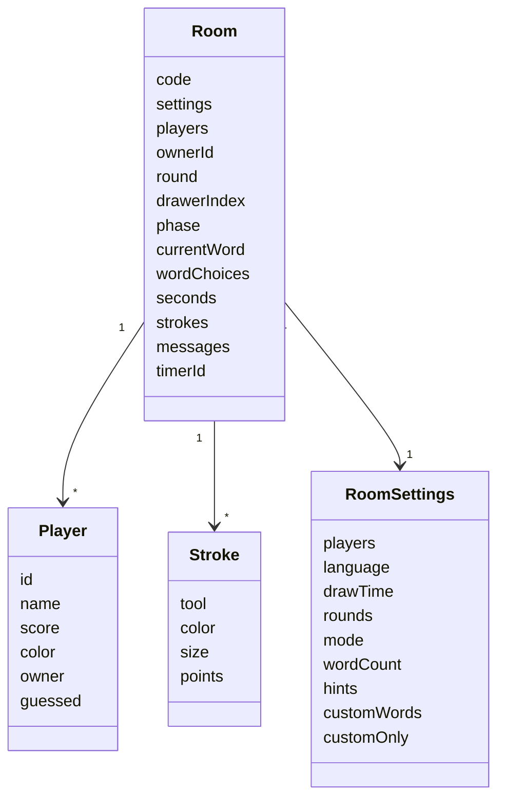
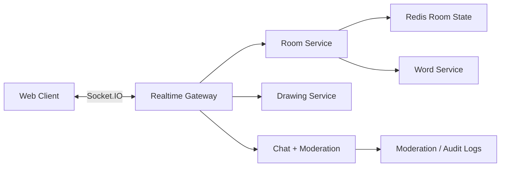

# Skribble Clone Design Notes

## Scope

This project is a realtime front-end clone of the skribbl.io experience. It recreates the visible product flow: nickname entry, quick play, private-room settings, invite links, room header, round timer, word choice, drawing canvas, toolbar, player list, chat, guessing feedback, scoring, and multi-user room sharing.

The implementation does not copy proprietary skribbl.io assets, backend behavior, moderation systems, or private word lists. It uses a local Node/Socket.IO server to coordinate live rooms and a Vite client to render the game.

## HLD

## HLD Components

- `Web Client`: renders lobby, room, canvas, toolbar, chat, settings, and invite modal.
- `Socket.IO Client`: sends user actions such as create room, join room, choose word, chat guess, stroke preview, stroke commit, undo, clear, and settings updates.
- `Node Realtime Server`: owns room creation, membership, timer ticks, current drawer, current word, score calculation, disconnect handling, and room broadcasts.
- `In-memory Room Store`: stores active room state in a `Map`, keyed by room code.
- `Turn Engine`: rotates drawer, creates word choices, starts/stops timers, advances rounds, and ends the game.
- `Canvas Stroke Sync`: broadcasts live stroke previews while drawing and commits final strokes into room history.
- `Invite Sharing`: room URLs use `?ROOMCODE`, allowing another browser/device to join the same Socket.IO room.

## LLD

## Socket Events

- `room:create`: client asks server to create a room with settings and nickname.
- `room:join`: client joins an existing room by invite code.
- `room:state`: server broadcasts the sanitized state for each client.
- `room:updateSettings`: room owner updates settings.
- `game:chooseWord`: current drawer selects the word.
- `chat:message`: guessers send chat messages; exact matches score points.
- `drawing:preview`: current drawer streams in-progress strokes to other users.
- `drawing:commit`: current drawer finishes a stroke; server stores and broadcasts it.
- `drawing:undo`: current drawer removes the last stored stroke.
- `drawing:clear`: current drawer clears the board.
- `room:error`: server reports join/create errors to the client.

## LLD Flow

1. User creates or joins a room from the lobby.
2. Server creates or retrieves a `Room`, joins the socket to the Socket.IO room, then emits `room:state`.
3. The current drawer receives private `wordChoices`; non-drawers only see waiting state.
4. Drawer emits `game:chooseWord`.
5. Server switches the room to `draw`, starts the authoritative timer, resets guesses and strokes, then broadcasts state.
6. Drawer pointer movement emits `drawing:preview`; other users see live in-progress strokes.
7. Pointer release emits `drawing:commit`; server stores the stroke and broadcasts it to everyone.
8. Guessers emit `chat:message`; the server validates exact guesses against the hidden word and updates scores.
9. Timer expiry calls `advanceTurn()`, rotates the drawer, increments rounds when needed, and emits the next state.
10. Disconnects remove players, transfer owner if needed, and clean up empty rooms.

## Technologies

- `Vite`: development middleware and production bundling.
- `Node.js`: runtime for the realtime server.
- `Express`: HTTP server and production static file serving.
- `Socket.IO`: WebSocket-style realtime communication with fallback support.
- `socket.io-client`: browser socket connection.
- `Vanilla JavaScript`: UI rendering, state handling, canvas interactions, and socket event wiring.
- `HTML5 Canvas`: drawing board, brush, eraser, undo, clear, and stroke replay.
- `CSS3`: responsive lobby/game layout, modals, toolbar, player list, and chat styling.
- `Mermaid`: architecture diagrams in this document.

## Design Rationale

- The server is authoritative for game state so multiple clients cannot disagree on drawer, timer, score, or hidden word.
- Each client receives a sanitized state; only the drawer receives the actual word and word choices.
- Strokes are stored as structured point arrays rather than pixels, making replay, undo, clear, and socket broadcast straightforward.
- Preview and commit are separate events so drawing feels live without saving every pointer movement as permanent history.
- The room store is in memory because this is a local clone. A production version would move active rooms into Redis or another shared low-latency store.

## Production Extension

For production, the same event model can be kept while moving room state to Redis, adding authentication, reconnect recovery, rate limiting, profanity filtering, room expiry, and horizontal Socket.IO scaling.
